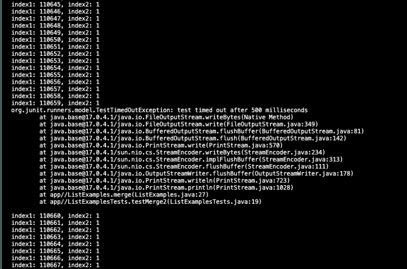

Lab Report 5

PeijinLi 
A17552769

Part 1

1. Original Post: Title: Issue with ListExamples.merge Method Not Merging Lists Correctly
Hey, Iʼm working on this ListExamples class, specifically the merge method. Itʼs
supposed to merge two sorted lists into a single sorted list. However, Iʼm running into an
issue where the method doesnʼt seem to be merging the lists correctly. Hereʼs a
screenshot of my output:

Result output:

For the first test, it merges lists with elements [“x”, “y”] and [“a”, “b”] just fine. However,
when it tries to merge [“a”, “b”, “c”] with [“c”, “d”, “e”], it gives us a 500 ms timeout.
Iʼm guessing thereʼs an issue when both lists contain a common element, which in our
case is “c”. This might be causing the merge function to enter an infinite loop.

2. TAʼs Response:

   Hello, great job on setting up your test cases and noticing the timeout during the second test.
   The fact that testMerge2 is timing out is indeed indicative of an infinite loop. Given that
   your first test passes but the second fails, we should look closely at what differs between
   the two scenarios.
   Youʼve made a good observation regarding the common element “c” in both lists for
   testMerge2. In a merge operation, itʼs critical that each element is only processed once,
   even if it appears in both lists. If the code mistakenly continues to compare the same pair
   of elements without moving forward, it could result in an infinite loop.
   Could you insert a few print statements inside the merge method to print out the values of
   index1 and index2 before and after you expect them to change? Like:
   System.out.println("index1: " + index1 + ", index2: " + index2); . This will help
   you solve the problem, feel free to reach out for more questions!

3. Code after advice:

I think it is pretty clear what the bug is. The index values index1 and index2 both increase initially, but then index1
continues to increment without index2 ever advancing past 1. So the bug is index1 is
incrementing in the while loop that is intended to iterate through list2 . This causes an
infinite loop because index2 , which controls the iteration over list2 , never increases
past 1, and therefore the condition index2 < list2.size() remains true, preventing the
loop from terminating.

4. Information about the setup:
The file & directory structure: I have one directory called lab 7, all java files and bash script are located inside this
   directory.

The contents of each file before fixing the bug:
ListExamples.java:

test.sh

The full command line (or lines) you ran to trigger the bug The command line I ran was:

Part 2:

During the second half of this quarter, I really enjoyed learning about Java Debugger (JDB).
Learning how to set breakpoints, step through code, inspect variable values deepened my
understanding of the execution flow and has significantly improved my debugging skills.
Additionally, becoming more proficient with Vim has streamlined my coding process, and
mastering GitHub commands via SSH has made version control and collaboration more secure
and efficient

