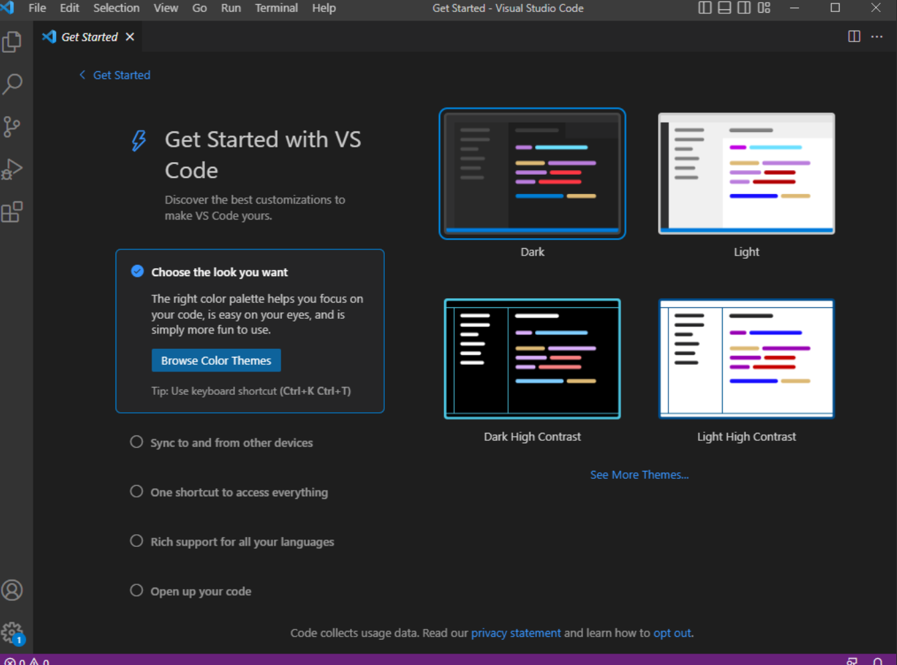
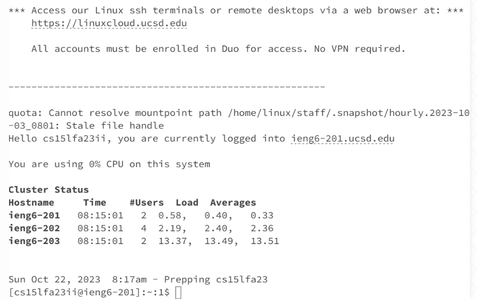
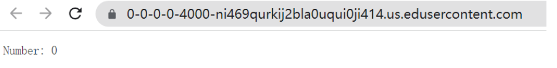
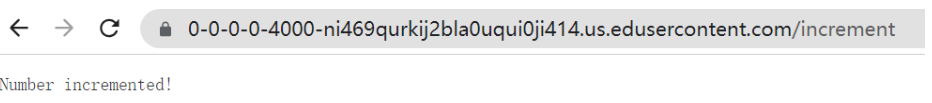
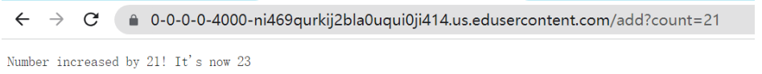
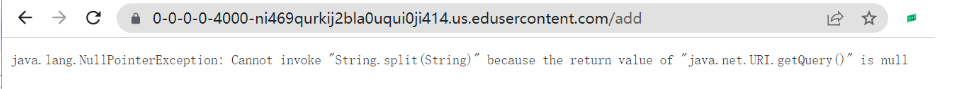
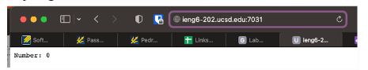
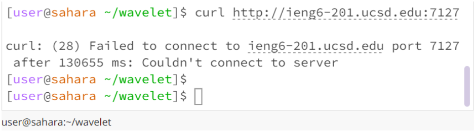
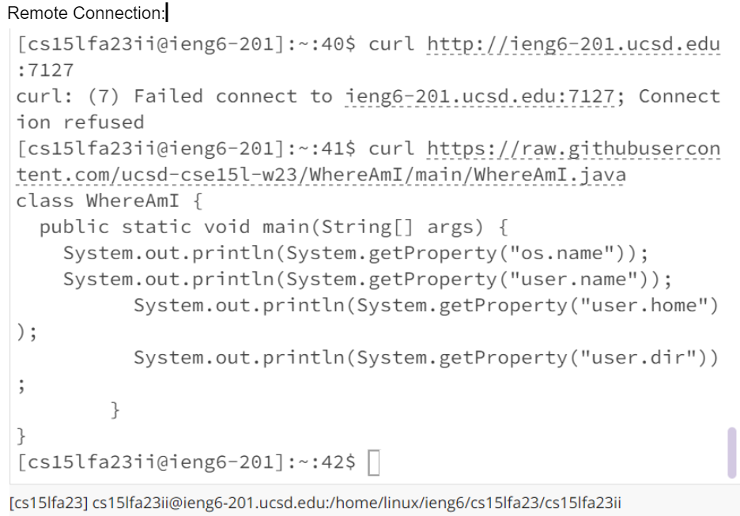

# Lab Report 2

## Part 1 – Meet Your Group!

I meet my 5 groupmembers! They all use their own computer, but I'm using school's computer.

## Part 2 – Your CSE15L Account

I created my account and transfer to CSE unique account, then reset password. I followed up the direction of [Link](https://drive.google.com/file/d/17IDZn8Qq7Q0RkYMxdiIR0o6HJ3B5YqSW/view), and use the [Link](https://sdacs.ucsd.edu/~icc/index.php) to enter the account.

## Part 3 – Visual Studio Code


I tried to installed the Visual Studio and GitBash. But since I'm using the school's computer I don't need to install it. I used [Link](https://code.visualstudio.com/) to download the Visual Studio and use [Link](https://gitforwindows.org/) to download the Git.

## Part 4 – Remotely Connecting

After running ssh, they asked me my password. In the beginning, I just copied and pasted my password, but it failed. Then I typed in the password more carefully and finally I  was able to login and got the following prompts.

## Part 5 – Building and Running the Server
### 5.1 Root

### 5.2 Increment

### 5.3 Add

### 5.4 Error


## Part 6 -  Run the Server on a Remote Computer




## Part 7 - Brainstorm a little bit.
1. Weather prediction web server
2. learn CSS to make page more beautiful

## Part 8 - Accessing URLs from the Command Line with curl
### 8.1 Run it local


### 8.2 Run it remotely



## Part 9 - Make the Simplest “Search Engine”
```
import java.io.IOException;
import java.net.URI;
import java.util.ArrayList;
import java.util.List;

class SEHandler implements URLHandler {
    // The one bit of state on the server: a number that will be manipulated by
    // various requests.
    List<String> table = new ArrayList<String>();

    public String handleRequest(URI url) {
        if (url.getPath().equals("/add")) {
            String[] parameters = url.getQuery().split("=");
            if (parameters[0].equals("s")) {
                String toAdd = parameters[1];
                add(toAdd);

                return String.format("%s has been added into list", parameters[1]);
            }
        } else if (url.getPath().equals("/search")) {
            String[] parameters = url.getQuery().split("=");
            if (parameters[0].equals("s")) {
                String toSearch = parameters[1];
                String ret = search(toSearch);
                if (ret.length() > 0) {
                    return String.format("search result:%s", ret);
                } else {
                    return String.format("search result: Nothing found");
                }
            }


        } else {

            return "404 Not Found!";
        }

        return "404 Not Found!";
    }

    private void add(String toAdd) {
        int ind = table.indexOf(toAdd);
        if (ind < 0) {
            table.add(toAdd);
        } else {
            ;
        }
    }

    private String search(String toSearch) {
        String ret = "";

        for (String elt : table) {
            if (elt.contains(toSearch)) {
                ret += elt + ";";
            }
        }

        return ret;
    }
}

class SearchEngine {
    public static void main(String[] args) throws IOException {
        if(args.length == 0){
            System.out.println("Missing port number! Try any number between 1024 to 49151");
            return;
        }

        int port = Integer.parseInt(args[0]);

        Server.start(port, new SEHandler());
    }
}
```


